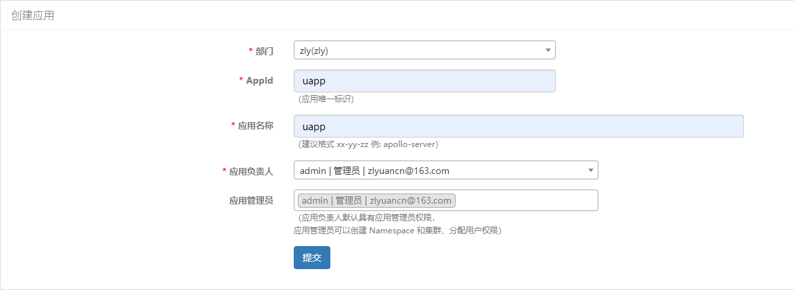
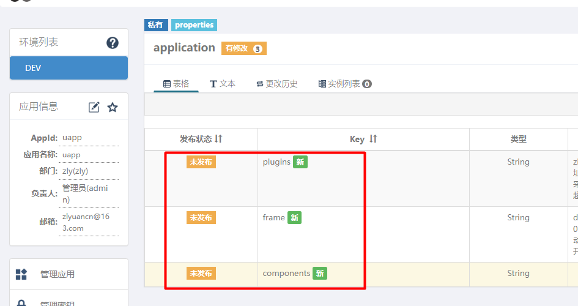

<!-- TOC -->

- [开始](#%E5%BC%80%E5%A7%8B)
- [提供的功能](#%E6%8F%90%E4%BE%9B%E7%9A%84%E5%8A%9F%E8%83%BD)
    - [组件](#%E7%BB%84%E4%BB%B6)
    - [插件](#%E6%8F%92%E4%BB%B6)
- [配置说明](#%E9%85%8D%E7%BD%AE%E8%AF%B4%E6%98%8E)
- [apollo 配置说明](#apollo-%E9%85%8D%E7%BD%AE%E8%AF%B4%E6%98%8E)

<!-- /TOC -->

---

一个基于 [zapp](https://github.com/zly-app/zapp) 封装的模板库, 提供了常见的组件, log, trace, 提供了默认连接到
apollo配置等功能.

# 开始

使用和 `zapp` 没什么区别

```go
app := uapp.NewApp("zapp.test")
defer app.Exit()

c := uapp.GetComponent() // 获取组件
```

# 提供的功能

## 组件

+ [x] [es7](https://github.com/zly-app/component/tree/master/es7)
+ [x] [mongo](https://github.com/zly-app/component/tree/master/mongo)
+ [x] [redis](https://github.com/zly-app/component/tree/master/redis)
+ [x] [sqlx](https://github.com/zly-app/component/tree/master/sqlx)
+ [x] [xorm](https://github.com/zly-app/component/tree/master/xorm)
+ [x] [pulsar](https://github.com/zly-app/component/tree/master/pulsar-producer)
+ [x] [cache 透明读缓存](https://github.com/zly-app/cache)

## 插件

+ [x] [apollo_provider apollo配置观察提供者](https://github.com/zly-app/zapp/tree/master/plugin/apollo_provider)
  `apollo配置观察提供者`只有在`应用配置`存在`apollo`时才会开启.
+ [x] [zipkinotel 链路上报](https://github.com/zly-app/plugin/tree/master/zipkinotel)
+ [x] [honey 日志收集](https://github.com/zly-app/plugin/tree/master/honey)

# 配置说明

配置分为两块, 一个是 `uapp配置`, 另一个是 `应用配置`. 在很多项目它们使用的数据库/中间件等的配置都是相同的, 那么可以放在`uapp配置`中, 而每一个单独的应用存在一些个性化配置, 则应该放在 `应用配置` 中.

默认情况下 `uapp` 会从 `uapp配置` 加载配置数据, 然后从当前的 `应用配置` 中加载配置数据来覆盖`uapp配置`的配置数据.

# apollo 配置说明

目前 `uapp配置` 主要支持从 `apollo` 获取配置数据.

首先在 `apollo` 创建一个 `uapp` 项目.



然后在 `application` 中添加好相关配置. 其格式默认为 `yaml`



此时 `uapp配置` 就完成了.

但是现在 `uapp` 还没有接入 `apollo`, 因为没有告诉 `uapp` 如何连接到 `apollo`, 需要在环境变量中配置 `ApolloAddress`,具体环境变量说明如下:

| 变量名                        | 是否必须 | 描述                                                                                                   | 默认值    |
| ----------------------------- | -------- | ------------------------------------------------------------------------------------------------------ | --------- |
| ApolloAddress                 | 否       | apollo-api地址, 多个地址用英文逗号连接, 如果不存在则不会使用apollo                                     |           |
| ApolloUAppID                  | 否       | uapp 应用名                                                                                            | uapp      |
| ApolloAppId                   | 否       | 当前应用名, 应用要覆盖 uapp 的配置                                                                     | \<app名\> |
| ApolloDisableApolloApp        | 否       | uapp不从apollo中获取`应用配置`                                                                         | false     |
| ApolloAccessKey               | 否       | 验证key, 优先级高于基础认证                                                                            |           |
| ApolloAuthBasicUser           | 否       | 基础认证用户名, 可用于nginx的基础认证扩展                                                              |           |
| ApolloAuthBasicPassword       | 否       | 基础认证密码                                                                                           |           |
| ApolloCluster                 | 否       | 集群名                                                                                                 | default   |
| ApolloAlwaysLoadFromRemote    | 否       | 总是从远程获取, 在远程加载失败时不会从备份文件加载                                                     | false     |
| ApolloBackupFile              | 否       | 备份文件名                                                                                             |           |
| ApolloApplicationDataType     | 否       | application命名空间下key的值的数据类型, 支持yaml,yml,toml,json                                         | yaml      |
| ApolloApplicationParseKeys    | 否       | application命名空间下哪些key数据会被解析, 无论如何默认的key(frame/components/plugins/services)会被解析 |           |
| ApolloNamespaces              | 否       | 其他自定义命名空间                                                                                     |           |
| ApolloIgnoreNamespaceNotFound | 否       | 忽略其他自定义命名空间不存在                                                                           |           |

环境配置完成后就可以启动程序了.

程序启动时 `upp` 读取`${ApolloUAppID}`作为 `uapp配置` 从`apollo` 加载配置的依据. 然读取`${ApolloAppId}` 作为`应用配置`从`apollo`加载配置的依据, 如果有重复配置`应用配置`会覆盖掉 `uapp配置`. 相当于 `uapp` 的配置作为一个基础配置数据.

如果 `${ApolloDisableApolloApp}` 为 `true`, 则不会加载`应用配置`, 使用者可以根据`zapp`支持的配置加载方式自行处理`应用配置`.
