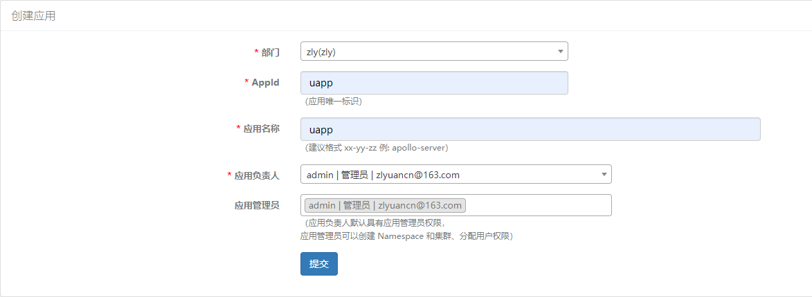
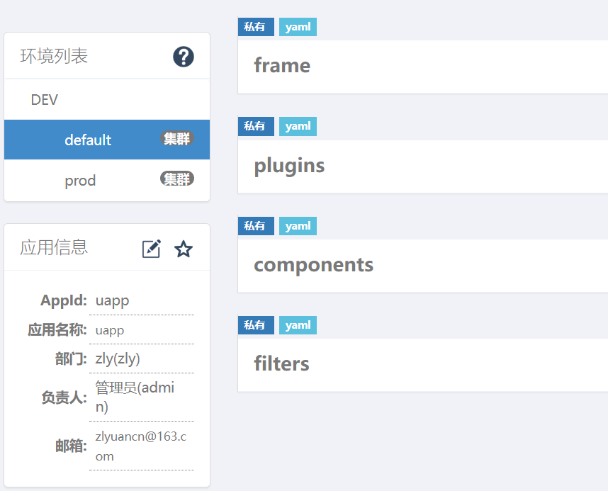
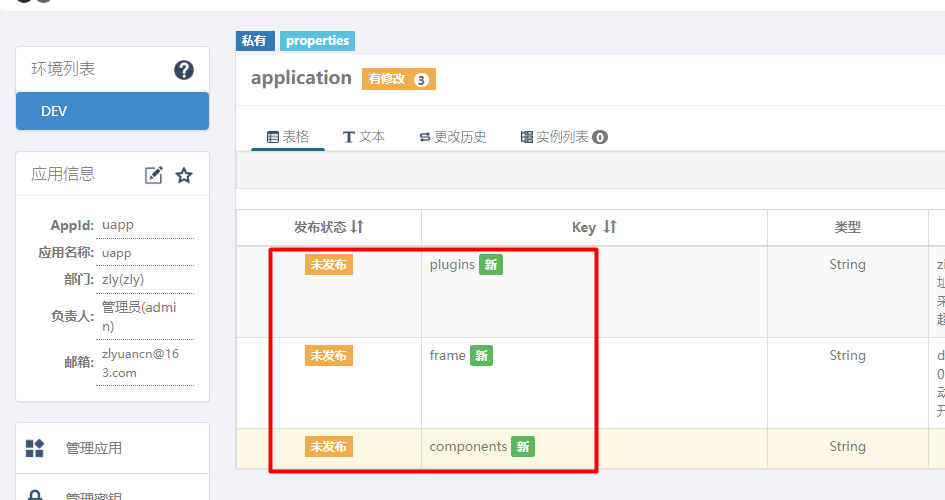

<!-- TOC -->

- [AI 开发快速指引](#ai-开发快速指引)
- [开始](#%E5%BC%80%E5%A7%8B)
- [提供的功能](#%E6%8F%90%E4%BE%9B%E7%9A%84%E5%8A%9F%E8%83%BD)
    - [组件](#%E7%BB%84%E4%BB%B6)
    - [插件](#%E6%8F%92%E4%BB%B6)
- [配置说明](#%E9%85%8D%E7%BD%AE%E8%AF%4E6%98%8E)
- [apollo 配置说明](#apollo-%E9%85%8D%E7%BD%AE%E8%AF%B4%E6%98%8E)
- [开发规范](#%E5%BC%80%E5%8F%91%E8%A7%84%E8%8C%83)

<!-- /TOC -->

---

# AI 开发快速指引

创建新项目时，将以下内容直接发送给 AI：

```
本项目基于 uapp/zapp 框架开发，请在项目根目录创建 AGENTS.md 文件，内容见:
https://github.com/zly-app/uapp#ai-开发注意事项
```

---

一个基于 [zapp](https://github.com/zly-app/zapp) 封装的模板库, 提供了常见的组件, log, trace, 提供了默认连接到
apollo配置等功能.

# 开始

使用和 `zapp` 没什么区别

```go
app := uapp.NewApp("zapp.test")
defer app.Exit()

app.Run()
```

# 提供的功能

## 组件

+ [x] [http.ReplaceStd](https://github.com/zly-app/component/tree/master/http) 替换 http 包的的 DefaultClient 和 DefaultTransport 以默认支持相关监测

## 插件

+ [x] [apollo_provider](https://github.com/zly-app/zapp/tree/master/plugin/apollo_provider) 
  `apollo配置观察提供者`只有在`应用配置`存在`apollo`时才会开启.
+ [x] [pprof](https://github.com/zly-app/plugin/tree/master/pprof) 性能分析工具（默认启用）
+ [x] [otlp](https://github.com/zly-app/plugin/tree/master/otlp) OTLP 链路追踪+指标上报（默认启用）

以下插件需手动启用：

+ [ ] [zipkinotel](https://github.com/zly-app/plugin/tree/master/zipkinotel) Zipkin 链路追踪（OpenTelemetry）
+ [ ] [honey](https://github.com/zly-app/plugin/tree/master/honey) 日志收集
+ [ ] [prometheus](https://github.com/zly-app/plugin/tree/master/prometheus) Metrics 上报到 prometheus

# 配置说明

配置分为两块, 一个是 `uapp配置`, 另一个是 `应用配置`. 在很多项目它们使用的数据库/中间件等的配置都是相同的, 那么可以放在`uapp配置`中, 而每一个单独的应用存在一些个性化配置, 则应该放在 `应用配置` 中.

默认情况下 `uapp` 会从 `uapp配置` 加载配置数据, 然后从当前的 `应用配置` 中加载配置数据来覆盖`uapp配置`的配置数据.

# apollo 配置说明

目前 `uapp配置` 主要支持从 `apollo` 获取配置数据.

首先在 `apollo` 创建一个 `uapp` 项目.



然后添加相关的配置



<details>
<summary>旧的配置方式</summary>
然后在 `application` 中添加好相关配置. 其格式默认为 `yaml`



</details>

此时 `uapp配置` 就完成了.

但是现在 `uapp` 还没有接入 `apollo`, 因为没有告诉 `uapp` 如何连接到 `apollo`, 需要在环境变量中配置 `ApolloAddress`,具体环境变量说明如下:

| 变量名                        | 是否必须 | 描述                                                                                                   | 默认值    |
| ----------------------------- | -------- | ------------------------------------------------------------------------------------------------------ | --------- |
| ApolloAddress                 | 否       | apollo-api地址, 多个地址用英文逗号连接, 如果不存在则不会使用apollo                                     |           |
| ApolloUAppID                  | 否       | uapp 应用名                                                                                            | uapp      |
| ApolloAppId                   | 否       | 当前应用名, 应用要覆盖 uapp 的配置                                                                     | \<app名\> |
| ApolloDisableApolloUApp       | 否       | uapp不从apollo中获取uapp配置, 不会影响`应用配置`的获取                                                 | false     |
| ApolloDisableApolloApp        | 否       | uapp不从apollo中获取`应用配置`                                                                         | false     |
| ApolloAccessKey               | 否       | 验证key, 优先级高于基础认证                                                                            |           |
| ApolloAuthBasicUser           | 否       | 基础认证用户名, 可用于nginx的基础认证扩展                                                              |           |
| ApolloAuthBasicPassword       | 否       | 基础认证密码                                                                                           |           |
| ApolloCluster                 | 否       | 集群名                                                                                                 | default   |
| ApolloAlwaysLoadFromRemote    | 否       | 总是从远程获取, 在远程加载失败时不会从备份文件加载                                                     | false     |
| ApolloBackupFile              | 否       | 备份文件名                                                                                             |           |
| ApolloApplicationDataType     | 否       | application命名空间下key的值的数据类型, 支持yaml,yml,toml,json                                         | yaml      |
| ApolloApplicationParseKeys    | 否       | application命名空间下哪些key数据会被解析, 无论如何默认的key(frame/components/plugins/services)会被解析 |           |
| ApolloNamespaces              | 否       | 其他自定义命名空间                                                                                     |           |
| ApolloIgnoreNamespaceNotFound | 否       | 忽略其他自定义命名空间不存在                                                                           |           |

环境配置完成后就可以启动程序了. 当然, 可以使用命令行来覆盖环境变量的值. 如 `myapp -ApolloAddress="http://localhost:8080"`

程序启动时 `uapp` 读取`${ApolloUAppID}`对应的apollo配置作为 `uapp配置`. 然后读取`${ApolloAppId}`对应的apollo配置作为`应用配置`, 如果有重复配置则 `应用配置`会覆盖掉 `uapp配置`. 相当于 `uapp` 的配置作为一个基础配置数据, 而`应用配置`能做个性化的变更.

如果 `${ApolloDisableApolloApp}` 为 `true`, 则从默认配置文件加载`应用配置`.

注意. 用户通过代码或参数向`uapp`/`zapp`传入配置加载方式则会完全替换掉`uapp`/`应用配置`.

# 开发规范

> **重要**: 文档中列出的工具是经过验证的标准实现。如果这些工具不满足使用需求，请联系作者更新，**禁止自行实现**类似功能。

## AI 开发注意事项

以下为 AGENTS.md 文件的完整内容，AI 应将其写入用户项目根目录：

```markdown
## uapp 框架规范

本项目基于 uapp/zapp 框架开发，所有组件/工具应使用框架提供的标准实现。

### 工具能力速查表

| 需求 | 工具 | 导入路径 | 详见 |
|------|------|----------|------|
| 对外提供 API 网关 + 内部 gRPC 调用 | grpc | github.com/zly-app/grpc | https://github.com/zly-app/uapp/blob/master/src/scaffold/01-grpc.md |
| Redis 客户端 | redis | github.com/zly-app/component/redis | https://github.com/zly-app/uapp/blob/master/src/scaffold/02-redis.md |
| Redis 分布式锁/续期/CAS原子操作 | redis_tool | github.com/zlyuancn/redis_tool | https://github.com/zly-app/uapp/blob/master/src/scaffold/02-redis.md |
| 调用外部 HTTP 服务 | http | github.com/zly-app/component/http | https://github.com/zly-app/uapp/blob/master/src/scaffold/03-http.md |
| MySQL/PostgreSQL 等 SQL 数据库 | sqlx | github.com/zly-app/component/sqlx | https://github.com/zly-app/uapp/blob/master/src/scaffold/04-sqlx.md |
| 本地缓存/多级缓存(进程内+Redis) | cache | github.com/zly-app/cache/v2 | https://github.com/zly-app/uapp/blob/master/src/scaffold/05-cache.md |
| 周期加载/定时从数据源刷新数据 | loopload | github.com/zly-app/utils/loopload | https://github.com/zly-app/uapp/blob/master/src/scaffold/06-loopload.md |
| 定时任务(Cron) | cron | github.com/zly-app/service/cron | https://github.com/zly-app/uapp/blob/master/src/scaffold/07-cron.md |
| 协程池 | gpool | github.com/zly-app/zapp/component/gpool | https://github.com/zly-app/uapp/blob/master/src/scaffold/08-gpool.md |
| 进程内消息通知(发布-订阅) | msgbus | github.com/zly-app/zapp/component/msgbus | https://github.com/zly-app/uapp/blob/master/src/scaffold/09-msgbus.md |
| 指标收集(Counter/Gauge/Histogram) | metrics | github.com/zly-app/zapp/component/metrics | https://github.com/zly-app/uapp/blob/master/src/scaffold/10-metrics.md |
| 配置文件/配置变更监听 | config | github.com/zly-app/zapp/config | https://github.com/zly-app/uapp/blob/master/src/scaffold/11-config.md |
| 单飞(防缓存击穿) | zsingleflight | github.com/zlyuancn/zsingleflight | https://github.com/zly-app/uapp/blob/master/src/scaffold/12-utils.md |
| 批次轮转(批量写入/轮转刷新) | rotate | github.com/zlyuancn/rotate | https://github.com/zly-app/uapp/blob/master/src/scaffold/12-utils.md |
| 重试 | zretry | github.com/zlyuancn/zretry | https://github.com/zly-app/uapp/blob/master/src/scaffold/12-utils.md |
| 通用工具(并发/Recover/三元/Trace等) | zapp/pkg/utils | github.com/zly-app/zapp/pkg/utils | https://github.com/zly-app/uapp/blob/master/src/scaffold/12-utils.md |
| 通用工具2(原子值/时间解析等) | zutils | github.com/zlyuancn/zutils | https://github.com/zly-app/uapp/blob/master/src/scaffold/12-utils.md |
| 日志 | log | github.com/zly-app/zapp/log | https://github.com/zly-app/uapp/blob/master/src/scaffold/14-log.md |

### 禁止事项

- 禁止自行实现上述已列出的工具（日志、缓存、数据库连接池、分布式锁等）
- 禁止使用标准库 log 包（应使用 github.com/zly-app/zapp/log）
- 禁止直接使用 zap.NewProduction() 等自行创建 logger
- 禁止自行实现日志轮转、日志采集等功能
- 禁止使用未在本规范中列出的第三方库替代标准工具

如现有工具不满足需求，应联系框架维护者更新，而非自行实现。
```

## 工具索引

详细说明、完整工具列表、关键词索引、场景指南 → **[开发规范总览](src/scaffold/00-overview.md)**
